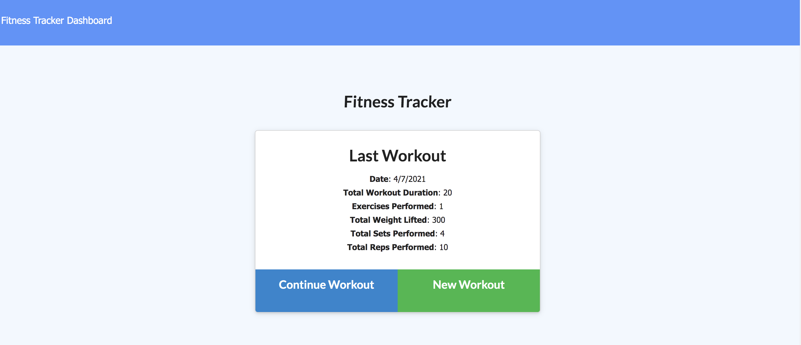

# workout_tracker

Everyone knows that if you have accountability for your goals you follow through more easily. This is a workout tracker to add accountability for your workouts!

## User Story:

```As a user, I want to be able to view create and track daily workouts. I want to be able to log multiple exercises in a workout on a given day. I should also be able to track the name, type, weight, sets, reps, and duration of exercise. If the exercise is a cardio exercise, I should be able to track my distance traveled.```

## Use of App

To use the app, navigate to the home page. Your last workout will appear in the white box. You can choose to add a New Workout or Continue the existing workout.

 

So let's add a New Workout. Upon clicking the New Workout button, a dropdown menu appears where you can choose the type of workout - either Resistance or Cardio. Select the one you want and follow the prompts to enter your workout details. You can click Add Workout, if you have more you want to complete that day, or Complete if you're done for the day.


You can keep track of your progress by visiting the Dashboard page. This page accesses the database and retrieves information for all your workouts and displays them in user-friendly charts.


## The Code

This  app was created using basic HTML, CSS, and Bootstrap to style the main pages. JavaScript was used to populate the data from a MongoDB using and Express server to get the different API and HTML routes. Once deployed to Heroku the app utilizes an AtlasDB cloud database to store the workout data.

Technologies and Packages Used:

```
HTML
CSS
Bootstrap
JavaScript
MongoDB
Mongoose
Express
Heroku
AtlasDB
Morgan
```

## Deployment

The app is deployed on Heroku at: <a href="https://evening-peak-04669.herokuapp.com/stats">https://evening-peak-04669.herokuapp.com/stats</a>
